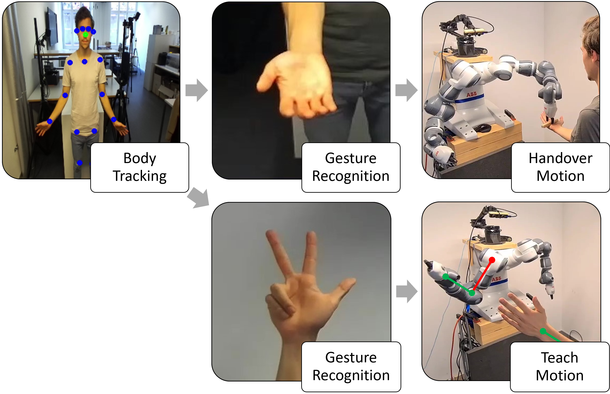
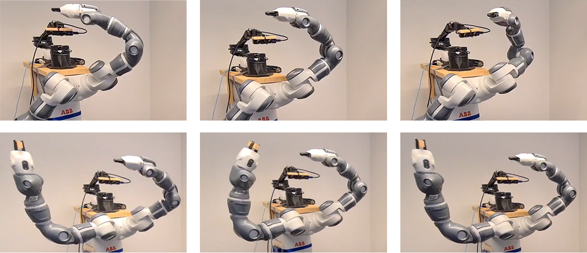
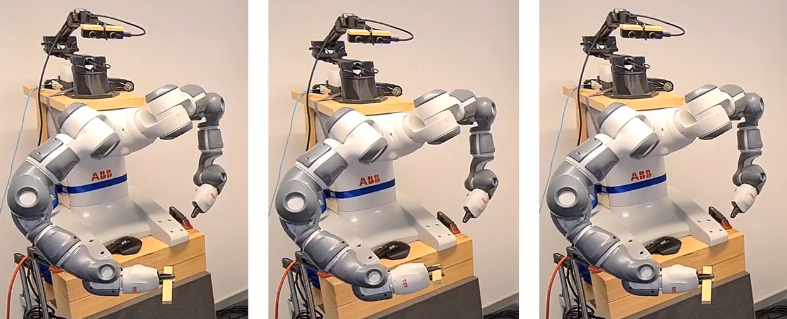
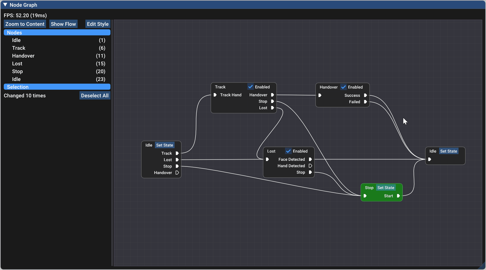

## Introduction
Using a robotic camera arm (equipped with a ZED stereo camera) mounted on a YuMi robot (a fixed base robot with two arms), the goal is to achieve natural human-robot collaboration. This includes handovers of objects and teaching the robot motions by demonstrating them with the user's own arms. To do so, visual human pose estimation and gesture recognition together with modern trajectory optimization algorithms are combined. Depending on the recognized gesture, different actions are taken.

The full demonstration videos can be found here:

### Handover Demonstration

The camera arm first follows the face and starts to follow the hand that raises above the nose.
Then, a "Handover" gesture is performed (the open hand is reached out towards the robot), which means the person wants the robot to initialize a handover.
At that moment, the hand location is determined (using stereo vision). This location is indicated as a small red sphere in front of the robot in the visualization.
As a next step, a Trajectory Optimization is done, which avoids crashing into the hand of the human and ensures that the robot arm slowly approaches the hand from above and moves back to its initial position after the handover is performed.
The "Fist" gesture at the end tells the robot and the camera arm to stop their movements ("emergency stop").

### Human-Like Robot Motions
Human-like robot motions were implemented to give the user a feedback and an intuitive feeling of what the robot is currently doing.
If the robot doesn't see a person to work with, it puts one hand over the camera and looks around. If it finds a person, it waves to say hello and the user knows that the collaboration can start.

While it waits for the user's action, it gets bored and plays around with the object in its gripper if it holds any and places the other hand on its hip.

### Node Graph Demonstration
The current state of the robot is highlighted in the node graph. It can also be used to customize the flow of events by enabling / disabling states, by deleting links which will disable the respective state transition
or by creating new links (for example after the handover is performed, stop the application etc.).

## Content

This repo is a demonstration of my master's thesis, but it is not possible to make the code publicly available.

It includes the following tasks:
- **Body tracking**: Use body tracking algorithms to generate motion commands for a robotic camera arm such that the person being tracked remains inside the field of view of the camera. 
- **Gesture recognition**: Implement different modalities of gesture recognition, building on existing body tracking software to detect gestures such as the intention of a handover or hand signs to control the robot.
- **Robot motion**: Using trajectory optimization, generate collision-free motions needed for a handover (e.g. approach, retreat, follow, grasp, release) that are triggered depending on the gesture that is recognized and the teaching of new motions. Human-like robot motions were also implemented.
- **GUI**: A GUI and a Node Graph that are used to control and customize the behavior of the robot

