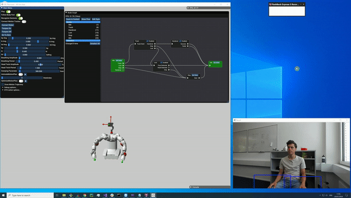

## Introduction

This repo is a demonstration of my master's thesis, but it is not possible to make the code publicly available.

The goal is to  combine  different  gesture recognition  modalities  (vision  based  and  data  driven)  together  with  modern  trajectory  optimization algorithms to perform natural handovers from a robot to a human.

This includes the following tasks:
- **Body tracking**: Use body tracking algorithms to generate motion commands for a robotic camera arm such that the person being tracked remains inside the field of view of the camera. 
- **Gesture recognition**: Implement different modalities of gesture recognition, building on existing body tracking software to detect gestures such as the intention of a handover or hand signs to control the robot.
- **Robot motion**: Using trajectory optimization, generate collision-free motions needed for a handover (e.g. approach, retreat, follow, grasp, release) that are triggered depending on the gesture that is recognized.
- **GUI**: A GUI and a Node Graph that are used to control and customize the behavior of the robot

### Demonstration

   <video  style="display:block; width:100%; height:auto;" autoplay controls loop="loop">
       <source src="nodeGraphDemo.mp4" type="video/mp4" />
   </video>

